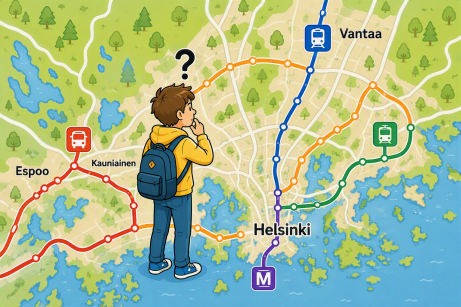

# HSL network analysis

In this example we are going to analyze the transport network of HSL
(Helsinki Region Transport). The data can be downloaded from the 
[HSL site](https://www.hsl.fi/en/hsl/open-data) (GTFS format).



We are interested in the efficiency of the communication, i.e. travel
times between any two stops, as a result of the concrete line network
and timetables. The main question is: given a **starting stop** and
**starting time**, what is the earliest time to reach each of the other stops?
(The solution is a vector containing a time value for each stop.)

If we can calculate this efficiently, we can study how changes in the network
(e.g. adding or removing a line) affect the efficiency of the public transport.

## 1. Data preprocessing

Let's start by loading some packages:
```{r}
library(dplyr)         # for data wrangling
library(geosphere)     # for distance calculation based on geocoordinates
library(hms)           # for timestamp processing
library(Matrix)        # for sparse matrices
library(readr)         # for data loading
library(Rcpp)          # for C++ optimizations
```

And loading the data:
```{r}
stop_times <- read_csv(
  "../../../../data/hsl/stop_times.txt", 
  col_types=list(stop_id = col_character())
)
stops <- read_csv(
  "../../../../data/hsl/stops.txt",
  col_types=list(stop_id = col_character())
)
```

Each row of the table `stop_times` represents a visit to a stop made by
a certain line. Let's convert it to a table that describes travels
*between* stops, with departure and destination stop, as well as time,
in each row. We will also convert the times to numeric values.
```{r}
transit_times <- stop_times |>
  select(trip_id, stop_id, stop_sequence, departure_time, arrival_time) |>
  arrange(trip_id, stop_sequence) |>
  group_by(trip_id) |>
  mutate(
    from_stop = stop_id,
    to_stop = lead(stop_id),
    dep = as.numeric(departure_time),
    arr = lead(as.numeric(arrival_time))
  ) |>
  ungroup() |>
  select(trip_id, from_stop, to_stop, dep, arr) |>
  filter(!is.na(to_stop)) |>
  arrange(dep)
```

## 2. The base algorithm

Normally a question like this would be solved by a graph search algorithm
(like Dijkstra's algorithm). However, our network is not a typical weighted
graph as it is time-dependent: edges from one stop to another are only
valid at certain points in time. This actually simplifies the computation.

A key observation is that we only need to iterate through the `transit_times`
table **once** if it is sorted by departure time. For each transit, we check:

* whether it is *usable*: can we reach the departure stop before the transit departs?
* whether it is *useful*: does it allow us to reach the destination stop earlier than known before?

Note that if the answer to any of these questions is "no", it will not change
after processing the rest of the table:

* all further arrival times are later than the currently considered departure time -> will not help us reach the departure stop earlier,
* earliest reach can only decrease -> a useless connection will not become useful.

As the conditions depend in the intermediate result (earliest reach known so far),
we implement the algorithm as a `for` loop.

```{r}
earliest_reach_r <- function(transit_times, start_stop, start_time) {
  stop_ids <- union(
    unique(transit_times$from_stop),
    unique(transit_times$to_stop)
  )
  result <- rep(Inf, length(stop_ids))
  names(result) <- stop_ids
  
  result[start_stop] <- as.numeric(start_time)
  for (i in 1:(nrow(transit_times))) {
    u <- transit_times$from_stop[i]
    v <- transit_times$to_stop[i]
    if (transit_times$dep[i] >= result[u] && transit_times$arr[i] <= result[v]) {
      result[v] <- transit_times$arr[i]
    }
  } 
  return(result)
}
```

```{r}
t <- Sys.time()
r <- earliest_reach_r(transit_times, "1020182", as_hms("08:00:00"))
Sys.time()-t
```

## 3. Rcpp optimization

The `for` loop in R is slow and there seems to be no way to vectorize
the computation. On the other hand, the logic inside the loop is very simple.
In this case, a C++ implementation offers a huge performance gain.

```{r}
cppFunction('
NumericVector solve_reach_cpp(IntegerVector from, IntegerVector to, 
                              NumericVector dep, NumericVector arr, 
                              NumericVector reach) {
  int n_edges = dep.size();
  
  for(int i = 0; i < n_edges; ++i) {
    // R is 1-indexed, C++ is 0-indexed. Subtract 1 from stop indices.
    int u = from[i] - 1; 
    int v = to[i] - 1;
    
    if ((dep[i] >= reach[u]) && (arr[i] < reach[v])) {
      reach[v] = arr[i];
    }
  }
  return reach;
}')

earliest_reach <- function(transit_times, start_stop, start_time) {
  stop_ids <- union(
    unique(transit_times$from_stop),
    unique(transit_times$to_stop)
  )
  stop_map <- setNames(seq_along(stop_ids), stop_ids)
  
  from_vec <- stop_map[transit_times$from_stop]
  to_vec   <- stop_map[transit_times$to_stop]
  dep_vec  <- transit_times$dep
  arr_vec  <- transit_times$arr
  
  result <- rep(Inf, length(stop_ids))
  result[stop_map[start_stop]] <- as.numeric(start_time)
  
  solve_reach_cpp(from_vec, to_vec, dep_vec, arr_vec, result)
  
  names(result) <- stop_ids
  return(result)
}
```

```{r}
t <- Sys.time()
r2 <- earliest_reach(transit_times, "1020182", as_hms("08:00:00"))
Sys.time()-t
```

Let's verify that the C++ version produces the same result as the pure R version:
```{r}
all(r2 == r)
```

## 4. Vectorization

Instead of calculating travel times from a certain starting time, we
travel times throughout the day (e.g. to calculate a mean).
This means that we need to sample the earliest reach for a certain stop
with many starting times - for example every 5 minutes.

Let's change the `earliest_reach` function so that `starting_time` is a vector.
The function should return a matrix with a row for each starting time.

```{r}
cppFunction('
NumericMatrix solve_reach_cpp_v(IntegerVector from, IntegerVector to, 
                                NumericVector dep, NumericVector arr, 
                                NumericMatrix reach) {
  int n_edges = dep.size();
  
  for (int i = 0; i < n_edges; ++i) {
    int u = from[i] - 1; 
    int v = to[i] - 1;
    
    for (int j = 0; j < reach.nrow(); ++j) {
      if ((dep[i] >= reach(j,u)) && (arr[i] < reach(j,v))) {
        reach(j,v) = arr[i];
      }
    }
  }
  return reach;
}')

earliest_reach_v <- function(transit_times, start_stop, start_time) {
  stop_ids <- union(
    unique(transit_times$from_stop),
    unique(transit_times$to_stop)
  )
  stop_map <- setNames(seq_along(stop_ids), stop_ids)
  
  from_vec <- stop_map[transit_times$from_stop]
  to_vec   <- stop_map[transit_times$to_stop]
  dep_vec  <- transit_times$dep
  arr_vec  <- transit_times$arr
  
  result <- matrix(
    rep(Inf, length(stop_ids)*length(start_time)),
    nrow=length(start_time)
  )
  result[,stop_map[start_stop]] <- as.numeric(start_time)
  
  solve_reach_cpp_v(from_vec, to_vec, dep_vec, arr_vec, result)
  
  colnames(result) <- stop_ids
  rownames(result) <- as.character(start_time)
  return(result)
}
```

```{r}
t <- Sys.time()
r2 <- earliest_reach_v(transit_times, "1020182", as_hms(c("08:00:00", "10:00:00")))
Sys.time()-t
```

## 5. Walking distance computation

The calculation so far has an important limitation: it only considers
traveling with HSL vehicles. Walking between stops (e.g. from bus to
metro) is not possible. To better accommodate for possible transfers,
let's add an estimated walking distance between stops as an alternative
to HSL connections.

The walking distance will be estimated in an extremely simplified way:
* based on geocoordinates, calculate the straight-line distance between stops,
* estimate a walking distance in minutes proportionally to that (e.g. 1 m/s).

Only stops in 1km radius should be considered for walking. Store the
distances in a sparse matrix.

```{r}
m <- as.matrix(stops |> select(stop_lon, stop_lat), )
d <- distm(m, fun=distGeo)
dimnames(d) <- list(stops |> pull(stop_id), stops |> pull(stop_id))
d[d > 1000] <- 0    # 1km radius

# convert d to a sparse matrix
walking_dist <- as(d, "dgCMatrix")
```

## 6. Integrating walking distance into the algorithm

Now, let's include the possibility of reaching a stop by walking to
our calculations. Every time we reach a new stop (= update the earliest
reach time of a stop), we retrieve its neighbors from the sparse matrix
and consider updating their earliest reach too.

```{r}
cppFunction('
NumericMatrix solve_reach_cpp_wd(IntegerVector from, IntegerVector to, 
                                 NumericVector dep, NumericVector arr, 
                                 IntegerVector wd_p, IntegerVector wd_i,
                                 NumericVector wd_x, NumericMatrix reach) {
  int n_edges = dep.size();
  
  for(int i = 0; i < n_edges; ++i) {
    // R is 1-indexed, C++ is 0-indexed. Subtract 1 from stop indices.
    int u = from[i] - 1; 
    int v = to[i] - 1;
    
    for (int j = 0; j < reach.nrow(); ++j) {
      if ((dep[i] >= reach(j,u)) && (arr[i] < reach(j,v))) {
        reach(j,v) = arr[i];
        
        // update the reach of nearby stops by walking
        // `q` is the ID of the stop we walk to
        for (int k = wd_p[u]; k < wd_p[u+1]; ++k) {
          int q = wd_i[k]-1;
          if (arr[i] + wd_x[k] < reach(j,q)) {
            reach(j,q) = arr[i]+wd_x[k];
          }
        }
      }
    }
  }
  return reach;
}')


earliest_reach_wd <- function(transit_times, walking_dist, start_stop, start_time) {
  stop_ids <- walking_dist@Dimnames[[1]]
  stop_map <- setNames(seq_along(stop_ids), stop_ids)
  
  from_vec <- stop_map[transit_times$from_stop]
  to_vec   <- stop_map[transit_times$to_stop]
  dep_vec  <- transit_times$dep
  arr_vec  <- transit_times$arr
  wd_p     <- walking_dist@p
  wd_i     <- walking_dist@i
  wd_x     <- walking_dist@x
  
  result <- matrix(
    rep(Inf, length(stop_ids)*length(start_time)),
    nrow=length(start_time)
  )
  result[,stop_map[start_stop]] <- as.numeric(start_time)
  # update the walking distances from the starting stop
  nn <- walking_dist@p[stop_map[start_stop]]:(walking_dist@p[stop_map[start_stop]+1]-1)
  result[,walking_dist@i[nn]+1] <- 
    matrix(rep(result[,stop_map[start_stop]], length(nn)), ncol=length(nn)) + 
    matrix(rep(walking_dist@x[nn], each=nrow(result)), nrow=nrow(result))
  
  solve_reach_cpp_wd(from_vec, to_vec, dep_vec, arr_vec, wd_p, wd_i, wd_x, result)
  
  colnames(result) <- stop_ids
  rownames(result) <- as.character(start_time)
  return(result)
}
```

```{r}
# every 5 minutes
times <- seq(as_hms("06:00:00"), as_hms("22:00:00"), length=16*12+1)
t <- Sys.time()
r3 <- earliest_reach_wd(transit_times, walking_dist, "1020182", times)
Sys.time()-t
```

## 7. Further ideas

* Calculate the tables for each stop using parallelization,
* Compare the differences in travel times if the network is changed,
* Plot the results on a map - e.g. show the stops with different color depending on how much the time to reach them changes when a certain line is removed.
