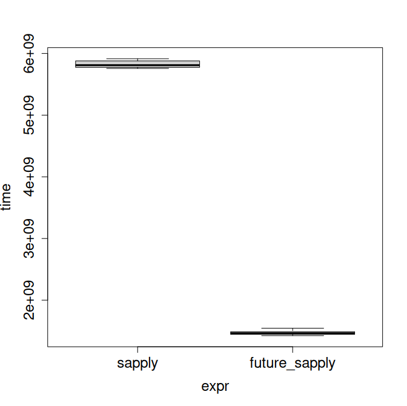

# Imperative vs Functional programming

:::: {.columns}

::: {.column }

### Imperative

* program = description what the computer should do
  * fine-grained control
  * in R: usually slow and clumsy

```r
count_ones <- function(x) {
  result <- 0
  for (i in 1:length(x)) {
    if (x[i] == 1) {
      result <- result + 1
    }
  }
  return(result)
}
```

:::

::: {.column }

### Functional

* program = formula for output depending on input
  * enforces conciseness
  * in R: uses the available **efficient** implementations

&nbsp;

```r
count_ones <- function(x) sum(x == 1)
```

:::

::::

# The functional programming style

:::: {.columns}

::: {.column }

### Constructs to <font style="color: var(--csc-magenta);">avoid</font>

* `{ }`
* `for`, `while`, `if`
* `<-` more than once per identifier

:::

::: {.column }

### Instead make <font style="color: var(--csc-green);">heavy use</font> of

* small function definitions <br/>
  `function(args) formula`
* vectors and matrices
  * `seq()`, `rep()` etc.
* the `apply()` family

:::

::::


# The Map-Reduce paradigm

Many computations follow this pattern:

* **map** each element of a sequence with a function,
* **reduce** the sequence to one element.

**Example**: Sum-of-squares

&nbsp;

:::: {.columns}

::: {.column width="70%" }

|   |   |     |     |     |     |     |     |
|:---|--:|----:|----:|----:|----:|----:|----:|
| | $x$ |  1  |  -2  |  3  |   -4 |  5 |  |
| MAP | $x^2$ |  1  |  4  |  9  |   16 | 25 |  |
| REDUCE | $y =$ | 1 |   + 4 | + 9 | + 16 | + 25 | = 55 | 

:::

::: {.column width="30%" }

```r
x <- c(1, -2, 3, -4, 5)
y <- sum(x^2)
```

:::

::::

# The Map-Reduce paradigm

:::: {.columns}

::: {.column }

### MAP

* arithmetics <br/>
  `x+1`, `2^x`, `log(x)`, ...
* string operations <br/>
  `paste()`, `grepl()`, ...
* logical operations <br/>
  `ifelse()`, `x > y`, ...

:::

::: {.column }

### REDUCE

* arithmetics <br/>
  `sum()`, `max()`, `mean()`
* string operations <br/>
  `paste(..., collapse='')`
* logical operations <br/>
  `any()`, `all()`

:::

::::

# The `apply()` family

Calculate a function on each element of a sequence ("map"):

* `apply()`: for matrices (row- or column-wise),
* `lapply()`: for lists,
* `mapply()`: element-wise for multiple vectors,
* `sapply()`: like `lapply()`, but simplifies the result
  * convert to a vector/matrix if possible.

# Functional programming: a more complex example

:::: { .columns }

::: { .column }

Let's simulate a simple game:

One player has two dice, the other one has three.

What is each player's probability of winning (getting higher combined
score than the other)?

(Normal six-sided dice. In case of equal score, the player with two dice wins.)

:::

::: { .column }


<p align="right"><small>image by Copilot</small></p>

:::

::::

# Functional programming: a more complex example

:::: { .columns }

::: { .column }

Breaking down the problem:

* we simulate many rounds <br/> (e.g. `n = 100`),
* in each round we calculate the combined score for each player,
* we compare the scores pairwise.

:::

::: { .column }

```r
multi_dice <- function(n, dice)
  rowSums(matrix(
	sample(6, n*dice, replace=T), nrow=n))

dice_game <- function(n)
  mean(multi_dice(n, 3) > multi_dice(n, 2))
```

:::

::::

# Benefits of functional programming in R

* clear and concise code,
* uses efficient built-in implementations,
* prepares the ground for parallelization (esp. map-reduce).

# Towards parallelization

:::: { .columns }

::: { .column }

* a modern CPU can run operations simultaneously in multiple *threads*,
  * my laptop: 6 cores, 12 threads,
  * Roihu: 192 cores, 384 threads,
* R uses a single thread by default ( = resource waste!),
* the `future` package family provides parallelization capabilities.

:::

::: { .column width="40%"}

```r
library(future)

# no parallelization
plan(sequential)

# multiple processes on one machine
plan(multicore, workers = 4)

# multiple processes on multiple machines
plan(cluster, workers = c("w1", "w2"))
```

:::

::::


# `future.apply`: parallel mapping

:::: { .columns }

::: { .column width="60%" }

```r
library(future)
library(future.apply)
library(microbenchmark)

plan(multisession, workers = 8)
cauchy_stats <- function(n_samples) {
  summary(rcauchy(n_samples))
}
mb <- microbenchmark(
  sapply = {
    x <- sapply(rep(10000, 10000), cauchy_stats)
  },
  future_sapply = {
    x <- future_sapply(
      rep(10000, 10000), cauchy_stats, future.seed=T)
  },
  times = 10
)
```

:::

::: { .column width="40%"}




:::

::::
