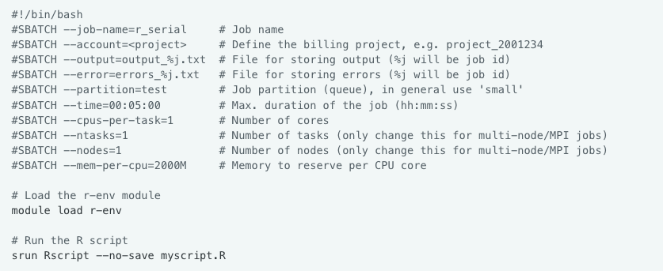

# Why run R on an HPC cluster?

-   HPC = high performance computing
-   more resources:
    - cores
    - memory
    - long runs
    - throughput: many jobs at at the same time
    - large and fast-access storage space
-   one core not much faster than on a normal computer\
    → **parallelization** to use many cores
-   pre-installed software
    -   R environment and packages

# Overview of CSC's computing services

-  <span style="color:blue;">Roihu </span> is CSC’s new national supercomputer, replaces Puhti and Mahti ☑️
-  <span style="color:blue;">LUMI </span> is a European pre-exascale supercomputer operated by CSC
-  <span style="color:blue;">Pouta </span> provides cloud resources via OpenStack (IaaS)
-  <span style="color:blue;">Rahti </span> provides containers via OKD (PaaS)
-  <span style="color:blue;">Allas </span> provides object storage for all services

# Puhti and Mahti are closing down

-  compute has been closed
-  data can be accessed until **15 October 2026**
-  move to Roihu: <https://docs.csc.fi/computing/systems-roihu/>


# Different on Roihu vs. Puhti/Mahti

- separate CPU and GPU side
    - `roihu-cpu.csc.fi`, `roihu-gpu.csc.fi`
- connecting with SSH requires [signing your public key and downloading a cerfiticate every 24 hours](https://docs.csc.fi/computing/connecting/ssh-keys/#signing-public-key)
- changes in fast local disk (NVMe) use

# Short introduction to supercomputers

:::: {.columns}

::: {.column }


:::

::: {.column }

<br>

One standard node on Roihu: 

-  384 cores
-  768 GiB of memory

:::

::::

Images from <https://csc-training.github.io/csc-env-eff/>

# High performance computing cluster

:::: {.columns}

::: {.column }


:::

::: {.column }

<br>

- node: lots of cores
- HPC cluster: lots of nodes

:::

::::

# A closer look at Roihu

:::: {.columns}

::: {.column }

{ width=100% }

:::

::: {.column }

- login nodes: no heavy computation!
- compute nodes
- file system
  - home: personal, 15 GB
  - `/projappl`: installations
  - `/scratch`: data for computations
:::

::::

# SLURM job scheduler


# R environment on Roihu

-   module `r-env`

``` r
module load r-env
```

-   loads the latest R version available on Roihu: <br><https://docs.csc.fi/apps/r-env/#available>
-   currently: R v. 4.6.1
-   loading a specific R version:

``` r
module load r-env/461
```

# r-env is a container-based module

-   self-contained environment
    -   limitations with using other modules on Roihu
    -   combining R and Python (improvements on-going)
-   RStudio Terminal panel: inside the container
- contains a lot more than R: geospatial and parallel computing software, Python etc. 

# R packages in r-env

-   over 1700 packages installed
-   packages of each R version **date-locked** to a specific date
    -   avoid conflicts between versions
    -   increase reproducibility
        -   package versions only updated in a new R version
-   avoid updating packages when installing new ones

# Adding new packages

Default package directory is write-protected. Two options:

<br>

1)  install yourself for your project in `/projappl` <br>
see: <https://docs.csc.fi/apps/r-env/#r-package-installations>
2)  ask for a general installation for all users (email servicedesk\@csc.fi)

# Interactive R on Roihu

-   **RStudio:** [Roihu web interface](http://www.roihu.csc.fi)
-   **console R**
    -   compute node shell
    -   `sinteractive` on terminal (see [Roihu documentation](https://docs.csc.fi/computing/running/interactive-usage/#the-sinteractive-command))

<br>

``` r
module load r-env
start-r
```

# Interactive R on Roihu

-   get started, develop and test R scripts
-   light or medium heavy interactive work up to a few hours
-   temporary files go to `/tmp` (20 GB space per user)
-   limitations on resources
    -   RStudio struggles → move to **batch jobs**

# Non-interactive R on Roihu: batch jobs

-   R script (.R)
    -   all R commands to be run
-   batch job script (.sh)
    -   reserves resources, loads modules, sets up environment
    -   bash script with a specific format

# Basic template for R batch job script on Roihu

{ width=80% }

# Submitting batch jobs

-   submitted on the login node
    -   login node shell in the Roihu web interface
    -   ssh on a terminal
-   by default, output and error files go to the same folder where job was submitted

<br>

``` bash
sbatch my_batch_job.sh
```

# Status of a batch job

To view the status of the job:

<br>

``` bash
squeue -u $USER
# or
squeue --me
```

To cancel a submitted job:\
- job id is shown on the terminal when you submit the job

<br>

``` bash
scancel <job_id>
```

# Resource use: `seff`

When the job has finished, check the resources it used:

<br>

``` bash
seff <job_id>
```


