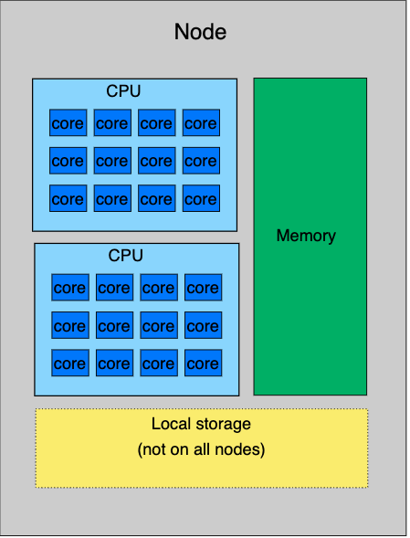
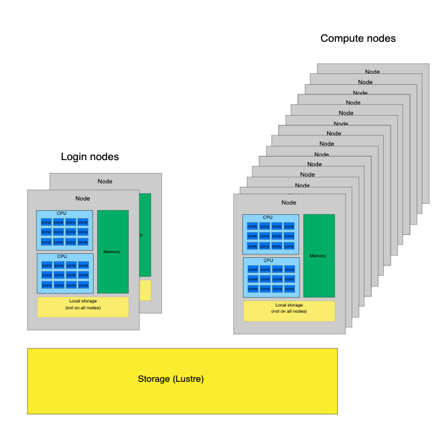
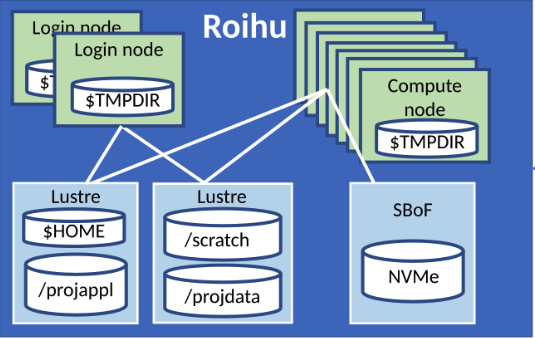
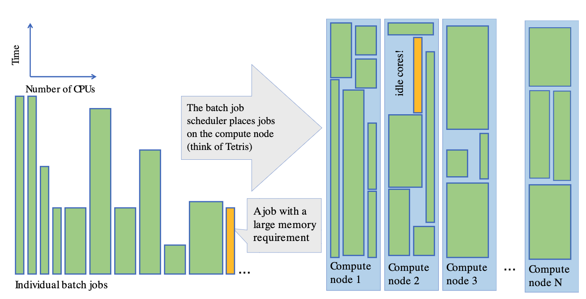

# Why run R on a high performance computing (HPC) cluster?

-   more resources:
    - cores
    - memory
    - long runs
    - throughput: many jobs at at the same time
    - large and fast-access storage space
-   pre-installed software
    -   R environment and packages
-   one core not much faster than on a normal computer\
    → **parallelization** to use many cores

# Overview of CSC's computing services

-  <span style="color:blue;">Roihu </span> is CSC’s new national supercomputer, replaces Puhti and Mahti ☑️
-  <span style="color:blue;">LUMI </span> is a European pre-exascale supercomputer operated by CSC
-  <span style="color:blue;">Pouta </span> provides cloud resources via OpenStack (IaaS)
-  <span style="color:blue;">Rahti </span> provides containers via OKD (PaaS)
-  <span style="color:blue;">Allas </span> provides object storage for all services

# Puhti and Mahti are closing down

-  compute has been closed
-  data can be accessed until **15 October 2026**
-  move to Roihu: <https://docs.csc.fi/computing/systems-roihu/>


# Different on Roihu vs. Puhti/Mahti

- separate CPU and GPU side
    - `roihu-cpu.csc.fi`, `roihu-gpu.csc.fi`
- connecting with SSH requires [signing your public key and downloading a cerfiticate every 24 hours](https://docs.csc.fi/computing/connecting/ssh-keys/#signing-public-key)
- changes in fast local disk (NVMe) use

# Short introduction to supercomputers

:::: {.columns}

::: {.column }




:::

::: {.column }

<br>

One standard node on Roihu: 

-  384 cores
-  768-1500 GiB of memory

:::

::::

Images from <https://csc-training.github.io/csc-env-eff/>

# High performance computing cluster

:::: {.columns}

::: {.column }



:::

::: {.column }

<br>

- node: lots of cores
- HPC cluster: lots of nodes

:::

::::

# A closer look at Roihu

:::: {.columns}

::: {.column }

{ width=100% }

:::

::: {.column }

- login nodes: no heavy computation!
```bash
module load r-env
R --no-save
```
- compute nodes
- file system
  - home: personal, 15 GB
  - `/projappl`: installations
  - `/scratch`: data for computations
    - note the [/scratch cleaning policy](https://docs.csc.fi/computing/usage-policy/#disk-cleaning)
:::

::::

# SLURM job scheduler



# R environment on Roihu

-   module `r-env` ([documentation](https://docs.csc.fi/apps/r-env/))

``` r
module load r-env
```

-   loads the latest R version available on Roihu: <br><https://docs.csc.fi/apps/r-env/#available>
-   currently: R v. 4.6.1
-   loading a specific R version:

``` r
module load r-env/461
```

# r-env is a container-based module

-   self-contained environment
    -   limitations with using other modules on Roihu
    -   combining R and Python (improvements on-going)
-   RStudio Terminal panel: inside the container
- contains a lot more than R: geospatial and parallel computing software, Python etc. 

# R packages in r-env

-   over 1700 packages installed
-   packages of each R version **date-locked** to a specific date
    -   avoid conflicts between versions
    -   increase reproducibility
        -   package versions only updated in a new R version
-   avoid updating packages when installing new ones

# Adding new packages

Default package directory is write-protected. Two options:

<br>

1)  install yourself for your project in `/projappl` <br>
see: <https://docs.csc.fi/apps/r-env/#r-package-installations>
2)  ask for a general installation for all users (email servicedesk\@csc.fi)

# Interactive R on Roihu

-   **RStudio:** [Roihu web interface](http://www.roihu.csc.fi)
    - up to 8 cores, 64 GB of memory, 16 hours
-   **console R**
    -   compute node shell in the Roihu web interface
    -   connect with SSH and use `sinteractive` in the terminal (see [Roihu documentation](https://docs.csc.fi/computing/running/interactive-usage/#the-sinteractive-command))
        - up to 32 cores, 60 GB of memory, 32 hours
<br>

``` r
module load r-env
start-r
```

# Interactive R on Roihu

-   get started, develop and test R scripts
-   light or medium heavy interactive work up to a few hours
-   temporary files go to `/tmp` (20 GB space per user)
-   limitations on resources
    -   RStudio struggles → move to **batch jobs**

<br>

- Tip: if web interface RStudio gets stuck &rarr; [reset RStudio user state](https://docs.csc.fi/computing/webinterface/rstudio/#rstudio-is-not-starting-and-i-see-a-grey-screen-what-should-i-do)

# Non-interactive R on Roihu: batch jobs

-   R script (.R)
    -   all R commands to be run
-   batch job script (.sh)
    -   reserves resources, loads modules, sets up environment
    -   bash script with a specific format

# Basic template for R batch job script on Roihu

```bash
#!/bin/bash
#SBATCH --job-name=r_batch       # Job name
#SBATCH --account=<project>     # Define the billing project, e.g. project_2001234
#SBATCH --output=output_%j.txt  # File for storing output (%j will be job id)
#SBATCH --error=errors_%j.txt   # File for storing errors (%j will be job id)
#SBATCH --partition=test        # Job partition (queue), in general use 'small'
#SBATCH --time=00:05:00         # Max. duration of the job (hh:mm:ss), here 5 min
#SBATCH --cpus-per-task=1       # Number of cores
#SBATCH --ntasks=1              # Number of tasks (only change this for multi-node/MPI jobs)
#SBATCH --nodes=1               # Number of nodes (only change this for multi-node/MPI jobs)
#SBATCH --mem-per-cpu=2000M     # Memory to reserve per CPU core (MB, here 2 GB)

# Load the r-env module
module load r-env

# Run the R script (here myscript.R)
srun Rscript --no-save myscript.R
```

# Submitting batch jobs

-   submitted on the login node
    -   login node shell in the Roihu web interface
    -   ssh on a terminal
-   by default, output and error files go to the same folder where job was submitted

<br>

``` bash
sbatch my_batch_job.sh
```

# Status of a batch job

To view the status of the job:

<br>

``` bash
squeue -u $USER
# or
squeue --me
```

To cancel a submitted job:\
- job id is shown on the terminal when you submit the job

<br>

``` bash
scancel <job_id>
```

# Resource use: `seff`

When the job has finished, check the resources it used:

<br>

``` bash
seff <job_id>
```


# Resource reservation tips

- reserve only what is needed (but please do reserve what is needed!)
  - shared system, shared resources
  - more resources (cores, memory) &rarr; longer queuing time
- start with a best guess and a small example
- then use `seff` and [`sacct`](https://a3s.fi/CSC_training/roihu/06_understanding_usage.html#/slurm-accounting-batch-job-resource-usage-22) to monitor resource use
  - low CPU efficiency?
      - is R code properly parallelized?
      - long steps where only one core used?
      - cores waiting for data from disk?
  - low memory efficiency? (note: not always reliable)

# File system tips

- reading or writing large numbers of small files is bad for the parallel file system (Lustre) &rarr; I/O (= input/output) intensive operations
- use temporary local storage (NVMe): `$TMPDIR` on Roihu
    - R temporary files go here
    - 20 GB per user by default
    - 600 GB when using a full node
    - note: automatically emptied when job finishes &rarr; move results to `/scratch`

# File system tips (2)

- especially I/O intensive jobs: Roihu `hugemem` and `vizinteractice` partitions
- more options coming with [disaggregated storage in Roihu](https://docs.csc.fi/computing/roihu-disk/#disaggregated-storage)
- see more on [local storage in Roihu](https://docs.csc.fi/computing/running/batch-job-partitions/#local-storage-on-roihu-nodes) and [temporary local disk areas in Roihu](https://docs.csc.fi/computing/roihu-disk/#temporary-local-disk-areas)
 
# File system tips (3)   

- avoid
    - accessing lots of small files or opening a single file repeatedly
    - too many files in a single directory
- using `tar` and compression is a good start ([instructions](https://docs.csc.fi/support/tutorials/env-guide/packing-and-compression-tools/))
    - lots of small files -> save as `tar.gz`-> extract in $TMPDIR

```bash
tar xf /scratch/<project>/big_dataset.tar.gz -C $TMPDIR
```

# Job planning

- avoid large numbers of small jobs
    - combine several in one R script
    - more than 20 short (<30 min) jobs &rarr; package into one job
- array jobs: submit up to 400 subtasks as one Slurm job
    - one subtask should ideally be around 30 min or longer
- [workflow tools](https://docs.csc.fi/computing/running/throughput/), `targets`

# Special partitions on Roihu

For most R jobs, use `small` for batch jobs and `interactive` for RStudio

Special partitions for higher resource needs:  

- `medium`: full nodes (600 GB of `/tmp` space)
- `longrun` : up to 10 days
- `hugemem` : up to 6037 GiB per job
- `hugemem_longrun`: up to 10 days and 6037 GiB

[More information on Roihu partitions](https://docs.csc.fi/computing/running/batch-job-partitions/#roihu-cpu-partitions)


