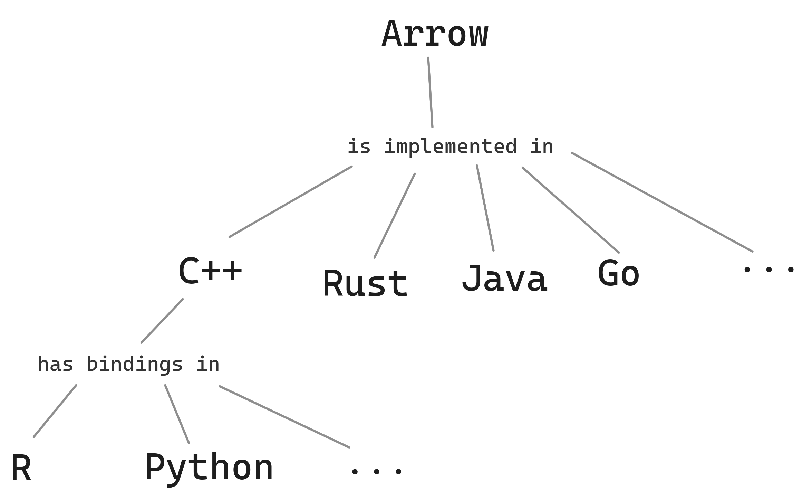
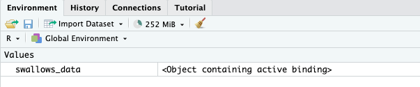
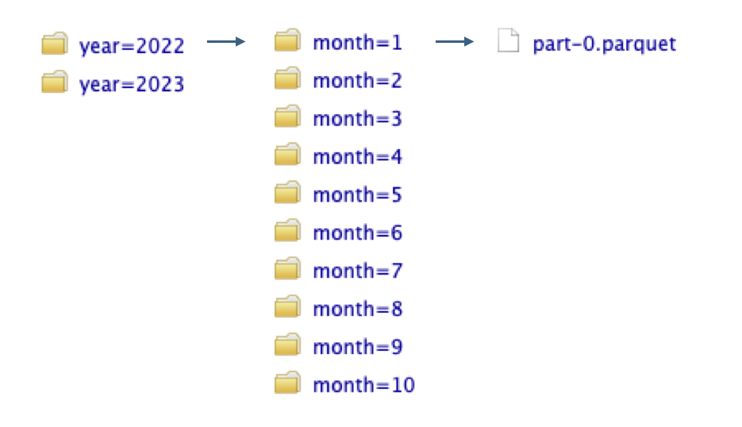

# Problems being solved

-   slow → faster: computing power as bottleneck → can the task use multiple cores?
-   many → more at once: carrying out similar, independent tasks/data sets concurrently
-   **big → memory & size of data or object as the bottleneck**

<br>

``` r
Error: cannot allocate vector of size X
```

# Use batch jobs instead of RStudio

-   RStudio struggles with heavy jobs
-   more resources available in batch jobs
    - up to 6037 GiB of memory per node on Roihu
-   no waiting at the screen
-   run several jobs at once

# Splitting the data set

-   split one large dataset into multiple smaller chunks to be processed in parallel
    -   split/apply/combine
    -   array jobs, multiprocessing with `future`
-   `multidplyr` package ([see more](https://multidplyr.tidyverse.org/articles/multidplyr.html))

# Improve code: memory-handling tips (see day 1)

-   do as little as possible
-   vectorization
    - ‘R-like’ scripting solves many problems
    -   `rowSums()`, `colSums()`, `rowMeans()`, `colMeans()`
-   use `rm()` in scripts to remove large unneeded objects
-   create functions to ensure temporary objects stay temporary
-   read in data inside parallel functions

# Watch out for growing objects

-   `for` loop + `c()`, `append()`, `cbind()`, `rbind()`, or `paste()`
-   pre-allocate objects in the final size
-   save results in a list and combine in the end
-   use functionals instead of a for loop (`purrr::map()` for data frames, `apply()`for matrices)

# Avoid operations that create a copy

-   copy-on-modify vs. modify in place
    -   R favours [copy-on-modify](https://adv-r.hadley.nz/names-values.html#copy-on-modify)
    -   where and how an operation is carried out matters
-   only one name bound to object → modified in place, no copy created

# Working with large data frames that fit in memory

-   `readr::read_csv()` in `tidyverse` is faster than `read.csv()`
-   [fastverse packages](https://fastverse.github.io/fastverse/):
    -   `data.table::fread()` instead of `read.csv()` / `read_csv()`
-   [fst](https://www.fstpackage.org/): another option for reading and writing csv files

# [data.table](https://r-datatable.com/) package

-   alternative approach to tidyverse
-   different syntax (SQL-like)
-   works well with large data sets
-   memory management: avoids copy-on-modify behaviour
-   uses threading → built-in parallelism
    -   on Roihu: use multiple cores + `OMP_NUM_THREADS` ([see r-env documentation](https://docs.csc.fi/support/tutorials/parallel-r-examples/#improving-performance-using-threading))

# What to do when dataset doesn't fit into memory?

-   another data format that takes less memory?
    -   matrix with lots of zeros: `sparseMatrix()`
    -   Parquet instead of CSV
-   [arrow](https://arrow.apache.org/docs/r/index.html) package + `dplyr`
    -   reading, writing and analyzing larger-than-memory datasets
-   similar database approaches: `duckdb` and `dbplyr` / `duckplyr`

# Object on disk instead of in memory

-   specific packages for big datasets
    -   matrices: `bigmemory`
-   options in packages
    -   example: `terra`package for spatial data
    -   large objects written to disk instead of kept in memory

<br>

``` r
terraOptions(todisk = TRUE, memmax = 50, verbose = TRUE)
```

# Closer look on using `arrow` with larger than memory data in R

{ width=50% }

Picture from Crane et al. [Scaling Up With R and Arrow](https://arrowrbook.com/)

# Apache Arrow project

- software framework and format started in 2016
- standard for efficient data analysis connecting different tools
- Arrow can work with R, Python, C++, Rust, Java, Go...
- **columnar data format** for tabular data
    - stored data is arranged by columns
- **schema**: metadata with Arrow's data types 

# `arrow` R package

- analysis of larger-than-memory data in R
- at the bottom: Arrow C++ library
- on the surface: large set of `tidyverse` & other familiar R functions
  - **`dplyr`**, `lubridate`, `stringr`; base R functions
  - see all: `?acero`
  - custom functions
- supported file formats: CSV, Parquet, JSON, Arrow/Feather

# What makes `arrow` fast and memory-efficient?

- parallel processing
- columnar data format
- supports Parquet format
- partitioning data
- lazy evaluation

# Lazy evaluation with `collect()`

- `collect()`: run calculations and return results to the R session
- nothing is read in or computed until `collect()` is run
- allows Arrow C++ library make many calculations in one operation

<br>

```r
hsl_data |> 
  filter(day = "Wed") |> 
  group_by(trip_id) |> 
  summarize(trip_length = max(shape_dist_traveled)) |> 
  arrange(trip_length) |> 
  collect()
```

# `collect()` vs. `compute()`

- `collect()`: returns R data frame
  - view results, pass them to other R functions
- `compute()` returns an Arrow table
  - continue with arrow or dplyr functions

# Parquet file format

- binary file format for storing data
- meant to be read by computers, not humans
- stores tabular data column-wise 
  → only necessary columns can be read

<br>

```r
# Reading in only selected columns of a Parquet file with arrow
selected_cols <- read_parquet("data/hsl_data.parquet", 
                col_select = c("day", "time", "stop_id"),
                as_data_frame = FALSE)
```

# Compared to CSVs, Parquet files are: 

- faster to read in (parallel processing for multiple files in `arrow`)
- smaller on disk (file compression)
- contain data type information (schema)  
<br>
→ good default for working with large tabular data

# When data fits into memory: Arrow Table

- working with single files
- data read **into memory**

<br> 

```r
#Read a CSV into memory as a tibble
hsl_data <- read_csv_arrow("data/hsl_data.csv")

# Read a CSV into memory as an Arrow Table 
hsl_data <- read_csv_arrow("data/hsl_data.csv", as_data_frame = FALSE)
```

# Metadata in arrow: schema

- Arrow objects and Parquet files contain detailed metadata that is not included in a CSV
- column names and **data types**
- note: data types are slightly different from R data types
- see more on [data types in arrow documentation](https://arrow.apache.org/docs/r/articles/data_types.html)

# Metadata in arrow: schema (2)
```r
# read in a CSV file as an Arrow table
hsl_data <- read_csv_arrow("data/hsl_data.csv", as_data_frame = FALSE)
schema(hsl_data)

# Schema
# trip_id: string
# arrival_time: string
# departure_time: string
# stop_id: int64
# stop_sequence: int64
# stop_headsign: string
# pickup_type: int64
# drop_off_type: int64
# shape_dist_traveled: double
# timepoint: int64
```
# Metadata in arrow: schema (3)

```r
hsl_data 

# Table
# 11526865 rows x 10 columns
# $trip_id <string>
# $arrival_time <string>
# $departure_time <string>
# $stop_id <int64>
# $stop_sequence <int64>
# $stop_headsign <string>
# $pickup_type <int64>
# $drop_off_type <int64>
# $shape_dist_traveled <double>
# $timepoint <int64>
```

# Metadata in arrow: schema (4)

- files with no metadata such as CSV  
→ `arrow` tries to guess data types of columns
- lots of missing data or e.g. dates → problems  
	→ define schema yourself, at least for the tricky columns (recommended)
- see more: [Arrow R book on defining schema](https://arrowrbook.com/files_and_formats.html#sec-schemas)

# When data is larger than memory: Arrow Dataset object

- data stays **on disk** (not loaded into memory)
- typically multiple Parquet files (partitioned data)
- files have no order
- by default `arrow` looks for Parquet files  
```r
hsl_data <- open_dataset(data/hsl_data)
```
- processed with `tidyverse` functions etc. similarly as Arrow Tables above
- `collect()` or `compute()` in the end to bring only the results into the R session

# When data is larger than memory: Arrow Dataset object (2)

```r
# read in data saved as an Arrow Dataset
hsl_data <- open_dataset("data/hsl_data")

hsl_data

# FileSystemDataset with 7 Parquet files
# 11 columns
# trip_id: string
# arrival_time: time32[ms]
# departure_time: time32[ms]
# stop_id: double
# stop_sequence: double
# stop_headsign: string
# pickup_type: double
# drop_off_type: double
# shape_dist_traveled: double
# timepoint: double
# day: string
```

# Partitioning

- data grouped by a variable (rows of a column)
- saved in separate directories & files
- each level of a variable becomes a separate file
- directory named by the column value
  - data not repeated in the Parquet file = Hive-style partitioning (from Apache Hive)
- can include multiple nested levels

# Partitioning (2)

- define the variable for partitioning in `write_dataset()`:

```r
hsl_data |> 
  write_dataset("hsl_dataset", 
  partitioning = "day")
```
- also listens to `dplyr::group_by()`

```r
hsl_data |> 
  group_by(day) |> 
  write_dataset("hsl_dataset")
```

# Example: convert a CSV larger than memory into a Dataset

```r
# Read in a single large CSV as an Arrow Dataset
swallows_data <- open_csv_dataset(path = "data/swallows_data.csv")

# Save the Dataset as partitioned Parquet files based on two variables
swallows_data |>
  mutate(year = year(datetime), month = month(datetime)) |>
  write_dataset(path = "data/swallows_dataset",
    partitioning = c("year", "month"))
```
<br>

{ width=75% }

# Converting a CSV into a Dataset: Partitioned Parquet files



# Partitioning vs. performance

- best partition size > 20 MB but < 2 GB
- smaller → metadata reading takes time 
- larger → multiple files not read in parallel by arrow

- big benefits for performance: `arrow` reads only the relevant partitions
- choose partitioning based on most often queried variables
  - `filter()` → rest of the data not read


# Learn more on Arrow & references

- Scaling Up With R and Arrow: [https://arrowrbook.com/](https://arrowrbook.com)
- arrow R package: [https://arrow.apache.org/docs/r/index.html](https://arrow.apache.org/docs/r/index.html)
- recent R consortium webinar on Arrow in R: [https://niccrane.com/r-consortium-webinar.pdf](https://niccrane.com/r-consortium-webinar.pdf)
- geoarrow: Arrow for spatial data: [https://geoarrow.org/](https://geoarrow.org/)
- nanoparquet: lightweight package for reading and writing Parquet files: [https://nanoparquet.r-lib.org/](https://nanoparquet.r-lib.org/)
	


